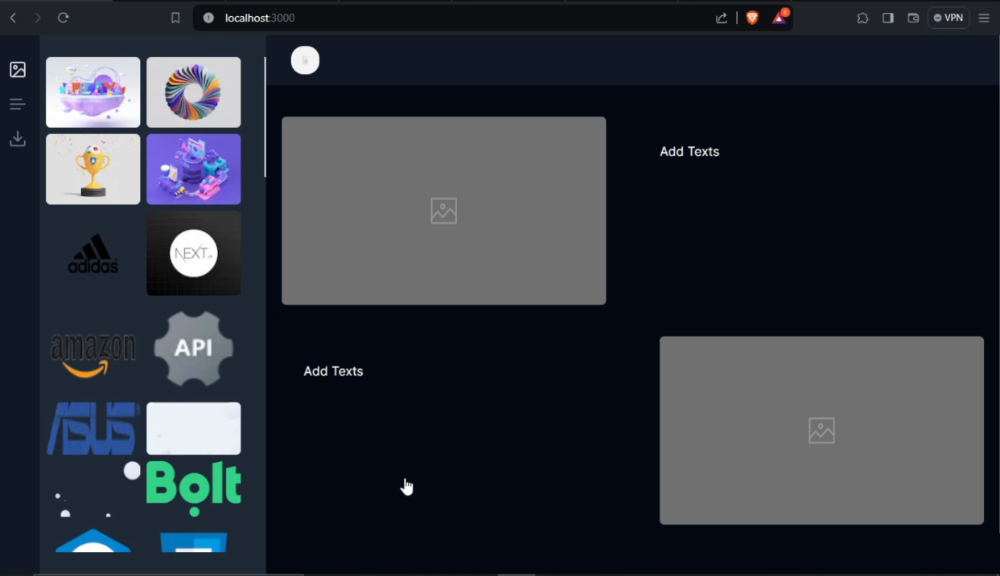
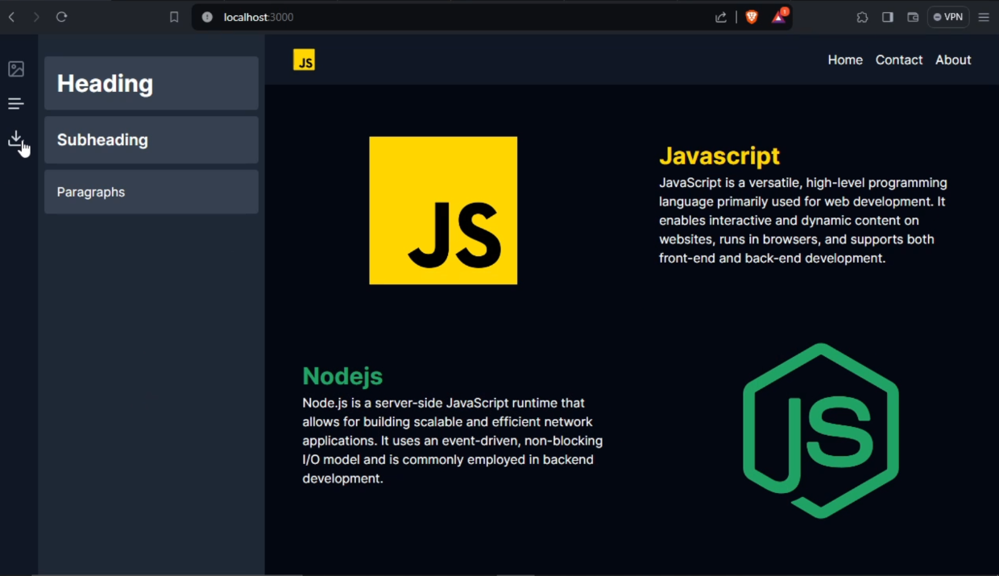

# Draggable - [ Drag & Drop Website Builder ]

- Techstack : nextjs, typescript, tailwind, and zustand
- **Problem Solved** : No need to write code just drag and drop to build

## Features

- After build see in new window
- Copy the code and also get in console
- Drag and Drop images and texts
- Edit text content, text sizes, text colours etc.
- Edit image sizes
- Delete images & texts.

## Preview

- Video Link :https://drive.google.com/file/d/1UMisybhivy0Ul1TQ-3khXOOXlQ2_uW4m/view?usp=drive_link

- 
- 
